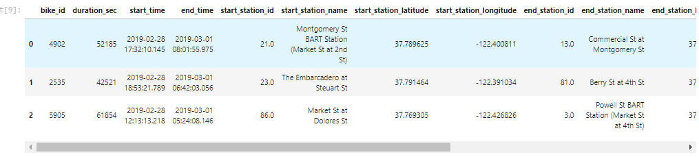
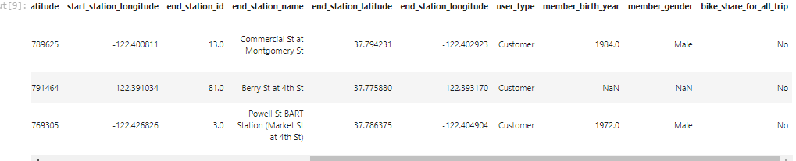
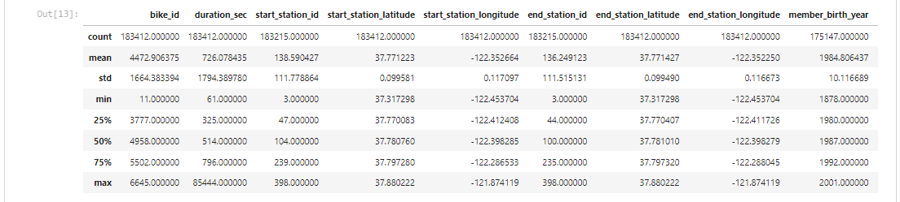
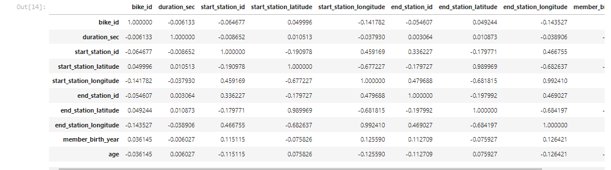

# 🚀 The Ford GoBike Trip Dataset 🚀
[](https://img.shields.io/badge/Python-3776AB?style=for-the-badge&logo=python&logoColor=white)
## Bright Ofori Boye Eshun


### Udactity Data Analyst Nanodegree Program

Git-hub repository at:
https://github.com/Bright136/Communicating-Data-Findings-Udacity-Data-Analyst-Nanodegree-

- Jupyter notebook: **Exploration_of_trip_data.ipynb**
- data set: 201902-fordgobike-tripdata.csv


# Table of contents
1. [Introduction](#introduction)

2. [Description of the data set](#section2)

3. [Preliminary Wrangling](#wrangling)
    1. [Initial steps ](#sec3p1)
    2. [Feature Engineering](#sec3p2)
    3. [Descriptive statistics and Correlation](#sec3p3)
4. [Exploration](#exploration)
    1. [Univariate Exploration](#univatiate)
    2. [Bivariate Exploration](#bivariate)
    3. [Multivariate Exploration](#multivariate)


4. [Findings and Conclusion](#conclusion)

    
    
6. [Key Insights](#insights)


## 1. Introduction <a name="introduction"></a>
- This README describes analysis done on FordBike Go Rental for Udacity Data Analyst Nano Degree Program.Resources used include Python and its associated packages such as numpy, pandas, seaborn and matplotlib. All these packages came as part of the Anaconda Distribution.

- The Exploration analysis takes the form of a single Jupyter notebook of filename given above. To view this file, download it from this repository and start Jupyter notebook in the folder containing the file. Use the command **Jupyter notebook** on the command line. 

- This repository also conatains a ststic version of the notebook in the form of a html file. To go to this file kinly follow the link: 
. 
- This project includes visualizations built seaborn and matplotlib. The main purpose of this project was to differentiate between and determine when the to use the various types of visualizations-Univarite Visualizations, Bivariate Visualizations and Multivariate Visualizations.

- I have tried to structure the Jupyter notebook and this README so that they have corresponding sections. However, I do not wish to merely repeat here what has been stated in the notebook. I will endeavour to have this README summarize the work of the notebook and, hopefully, complement the analyses done there.

##  2. Description of the data set <a name="section2"></a>
This data set includes information about individual rides made in a bike-sharing system covering the greater San Francisco Bay area stored in 201902-fordgobike-tripdata.csv file. The idividuals have been group by gender(male, female and other) and by the type of users they are, whether subcribers or customers. They birth year of the individuals were also given, hence we can go to calculate for their ages since the year at the time was 2019. The data contains 183412 rows and 16 columns


##  3. Preliminary Wrangling <a name="wrangling"></a>
For this part of the analysis, we have been asked to gather and clean the data whuch would be used for analysis. The data was downloaded from the Udacity dataset portal. The has been partially cleaned, hence the cleaning process would not be tedious. 
### 3.1 Initial steps <a name="sec3p1"></a>
I often google the project to see how other people have investigated data sets using Python. The very first step is always to check if the data needs cleaning by looking for duplicate rows, zero values or NaNs where they shouldn't be, etc. The head of the data set looks like:




Pandas **info()** was used to check the general information on the dataset, like the notnull values, the columns' data types and the shape of the data. The dataset has 183412 rows and 16 columns.

Some columns which were not in the proper data types were chenged inot their the appropraites.
Sample codes used to change data types to datetime data type:
```
# define a function to drop rows and columns 
def change_to_date(col):
    df[col] = pd.to_datetime(df[col])


# changing columns to date
change_to_date( 'end_time')
change_to_date( 'start_time')

```
Sample codes used to change data types to numerical data type:

```
# convert member_birth_year to Int data type
df['member_birth_year'] = df['member_birth_year'].astype('Int64')

```
### 3.2 Feature Engineering <a name="sec3p2"></a>
In order to be able to anser the questions have i raised it was necessary to create another feature. The **age** feature was created using the code below:
```
df['age'] = (2019 - df['member_birth_year'])

```
The relationship between the age and other features would be explored.
### 3.3 Descriptive statistics and Correlation<a name="sec3p3"></a>
Pandas **describe()** and **corr()** can provide a quick summary of the data set and correlation between the columns respectively as outlined in the notebook. 

The output of pandas **describe(include="all")** is shown below. 



The output of pandas **corr(method="pearson")** is shown below. 




## 4. Exploration  <a name="exploration"></a>
Under this part of the analysis the relationships between the features inthe dataset wwere explored using visuals. These visual were classified under three types; Univariate explaoration which the visualization involving only one dependable variable, Bivariate visualizations which involves exploring the relationship between two variables and Multivariate visualization which explores the relationships  between three variables. The features of interest were user_type, member_birth_year, member_gender and duration_sec.

### 4.1 Univariate Exploration <a name="univariate"></a>
#### Duration
This plot describes the distribution of duration in seconds per trip. We realize most of the trips were within the 250 sec to 2000 secs range.
  

#### Age
This plot describes the distribution of age in years per trip. We realize the distibution is concentrated between the ages of 20 and 40 years. This most frequent riders fell within that age range


### 4.2 Bivariate Exploration <a name="bivariate"></a>
#### Duration Vs Age
This plot describes the relation bewteen  age and duration. We realize from the graphs most riders who took longer trips were between the ages of 25 and 35 years
 


### 4.3 Multivariate Exploration <a name="multivariate"></a>
#### Durations vs Gender, Age
This plot describes the relation bewteen  duration against age and gender. From the graphs, we can see that the distribution is somehow the same for male and female but in other, the duration also decreases with age until it got to the ages around 55 years where the duration slightly jumps again.
  


## 5. Findings and Conclusion <a name="conclusions"></a>
#### Findings under the Univariate plots

<p style='text-align: justify'>All the users rode for more than 250 secs, majority of them rode in the range 250 and 2000 secs. At around 250 secs, the number of trips began to increase from 8000 trips with an increasing in duration sec to 12000 then it peaks at 650 secs. We realise that the trips decreases from 1200 downwards as the duration approaches 2000 secs. From the age distrution we realize the distribution is skewed positively and also more trips are concerntrated between the ages of 20 and 40 with most of them being 31 years old. Amongst the users, subscribers occupied more than 0.75 fraction of the total and gender wise most of these users were males, occupying 74.6 percent of the total.</p>

#### Findings under the Bivariate plots

<p style='text-align: justify'>All three genders had almost the same median duration but averagely, female and other took longer trips than males, which is interesting. Male, female and other had a lot of outliers when plotted(boxplot) against duration. Most frequest users who took longer trips were within the ages of 25 and 35 years. Also we realise that most users who crossed the 1000 sec duration were between the ages of 20 and 60 years. Most of the ages in all genders were also concerntrated around the ages of 20 to 40 years. Averagely, customers took longer trips than subscribers. There were more males subcribers and males customers than the other genders and this was not shocking because out of the total males were more than twice as much as females and more 30 times as much as others.</p>

#### Finding under the Multivariate plots
<p style='text-align: justify'>Interestingly, although when we plotted gender against duration, we found out other gender took longer rides than male and female, when the user type parameter was added, now we notice female customers took longer rides than the rest of the gender of customers but amongst subcribers the other gender took longer rides. We also notice that subscribers between the ages of 50 to 60 took longer trips than customers between the same ages. The distrinution of duration against age for both male and femal seems to have the same trend- as the age increases, the duration decreases, but for the other gender we can notice the same pattern except for the ages around 55 years where there is an increase in duration. The duration for old age in other is averagely higher.</p>

## 6. Key Insights <a name="insights"></a>
The main findings of this analysis are:
- In general users were within the ages of 18 to 104 and every user who took a ride passed the duration of 250 secs. 
- In both subcribers and customers, although male was the majority, other and female took longer trips than male, which is very interesting. 

- Also customer took longer trip than subcribers except a portion of old age subsribers (50 - 60 years) who took relatively longer trips.

- Users between the ages of 25 to 35 took longer trips than the rest. This trend ran through both gender and user types. Most of the users were 31 years old and this could contribute to this trend.

- Majority of the users who took trips of 2000 secs were users below 45 years. 

- We realised as the ages increases the trip duration decreases for all gender except in other where trip duration increased slightly for ages around 55 years.

-We realised a similar trend is users types between the ages of 50 and 60 who were subcribers compared to customers. They had relatively longer trip duration compared to customers. Could it be that this group of old age who are subcribers are of the gender other?


